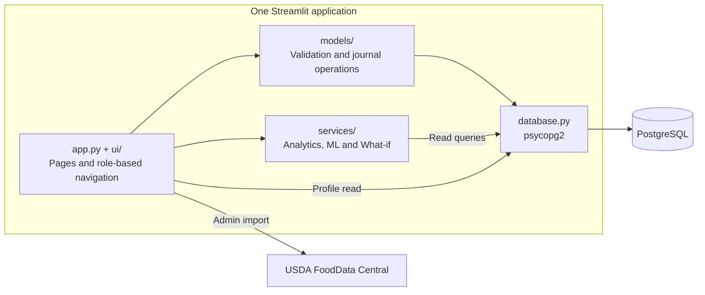

# MacroSense

MacroSense is a nutrition, activity and weight journal built with Python, Streamlit and PostgreSQL. It includes dashboard analytics, experimental weight predictions and a What-if simulator.

Developed as a bachelor's degree project. It runs locally with synthetic demo data; public deployment and security hardening are still pending.

The interface supports English and Romanian. English is the default. Stored category, goal and meal-type values remain unchanged; translations apply only to their display.

[Architecture](#architecture) · [Local setup](#local-setup) · [Tests](#running-tests) · [Demo walkthrough](#suggested-presentation-flow)

## What The Application Does

MacroSense supports two main roles:

- Administrators manage the food and activity catalogs, including optional imports from USDA FoodData Central.
- Users track meals, workouts, body weight, custom meals, dashboard progress, ML predictions, and What-if scenarios.

The application includes:

- Role-based authentication for users and administrators.
- Food logging with calories, protein, carbohydrates, fats, meal type, quantity, time, edit, and delete flows.
- Activity logging with MET-based calorie estimation, TUT-inspired strength estimation, optional manual calorie override, edit, and delete flows.
- Body weight history with add, update, delete, reference-weight logic, and automatic recalculation of affected activity days.
- Custom meals built from catalog ingredients, with macro preview, archive/reactivate behavior, and historical nutrition snapshots.
- A read-only dashboard with BMI, BMR, estimated TDEE, calorie balance, consistency indicators, charts, recommendation cards, and 14/30-day weight predictions.
- A read-only What-if simulator that compares the real day with a simulated food and activity scenario.
- Admin catalog pages for foods and activities, with search, filters, source metadata, validation, and USDA import.
- PostgreSQL data integrity rules, constraints, triggers, and seed scripts.

## Tech Stack

- Python 3.12.
- Streamlit for the web interface.
- PostgreSQL for persistence.
- psycopg2 for direct database access.
- pandas for tabular transformations and analytics.
- Altair for dashboard visualizations.
- scikit-learn for model training and prediction.
- unittest for automated regression tests.
- pgAdmin for optional database inspection and SQL script execution.
- USDA FoodData Central API for optional live food import.

## Architecture

MacroSense is a modular monolith running as one Streamlit application. Pages call models for authentication and journal operations, and services for analytics, predictions and scenarios.



The profile sidebar and service loaders also read through `database.py`; this is not a strict three-layer architecture. Dashboard and What-if do not write to the database. ML training runs separately and saves local artifacts that prediction code loads.

| Start here | Responsibility |
| --- | --- |
| [app.py](app.py) | Page configuration, session initialization and role routing. |
| [ui/pages/](ui/pages/) | Auth, User and Admin routes; dashboard, journals, catalogs and What-if pages. |
| [ui/language.py](ui/language.py), [ui/translations_ro.py](ui/translations_ro.py) | Language selection and the local English-to-Romanian dictionary. |
| [ui/](ui/), [assets/](assets/) | Shared inputs, validation messages, tables, formatting, CSS and flag images. |
| [models/](models/), [models/tracking_models/](models/tracking_models/) | Authentication, domain validation and persistence. `models/tracking.py` re-exports the tracking classes. |
| [services/analytics/](services/analytics/), [services/recommendations/](services/recommendations/) | Dashboard calculations, read queries and rule-based recommendation cards. |
| [services/ml/](services/ml/), [services/what_if/](services/what_if/) | Weight prediction pipeline and separate, session-only scenario calculations. |
| [services/usda_food_data.py](services/usda_food_data.py) | USDA search and import client, used only by Admin. |
| [database.py](database.py), [schema.sql](schema.sql), [database/seeds/](database/seeds/) | Connection helper, schema constraints and optional demo/catalog data. |
| [tests/](tests/) | Automated validation and regression tests. |

### Language handling

UI code uses English source text, for example `translate("Food journal")`. The Romanian dictionary supplies `Jurnal Alimentar`; missing translations fall back to English. No translation API is called.

The flag buttons update `st.session_state["language"]`. Menus keep stable IDs such as `food_journal`; `format_func` only changes the label. Translated selections are synchronized on a language change so the chosen page, filters and draft inputs stay consistent.

## Main User Workflows

### Authentication And Roles

Administrators can:

- Add and inspect food catalog items.
- Add and inspect activity catalog items.
- Import food items from USDA FoodData Central when an API key is configured.

Users can:

- Register and log in.
- Track food, activities, weight, and custom meals.
- Inspect dashboard analytics and predictions.
- Run What-if simulations without changing saved data.

### Food Journal

Record daily intake from catalog foods or saved custom meals:

- Quantity-based calorie and macronutrient calculation.
- Meal type and time of consumption.
- Live preview before saving.
- Edit and delete operations.
- Automatic recalculation of daily totals after every change.
- Searchable and filterable catalog selection.
- Source labels that distinguish MacroSense foods from USDA foods.
- Validation across UI, model layer, and database.

### Activity Journal

Track workouts and daily movement:

- Activity selection from a catalog with category, source, and MET-method filters.
- MET-based calorie estimation for cardio, flexibility, sports, and general activities.
- TUT-style estimation for strength activities using sets and repetitions.
- Optional manual calories from a watch or exercise machine, overriding the estimate for that entry.
- Decimal durations for short activity segments.
- Edit and delete flows.
- Automatic daily total recalculation.
- Weight-aware calorie estimation using the most relevant available weight log.

### Weight Journal

Weight history feeds dashboard charts, activity calorie estimates and ML features. When an entry changes, only activity days whose reference weight changed are recalculated; manual calorie entries are unaffected.

### Custom Meals

Build reusable meals from catalog ingredients:

- Ingredient selection from the food catalog.
- Quantity per ingredient.
- Live calorie and macronutrient preview.
- Atomic save/update behavior.
- Archive and reactivate support.
- Historical snapshots, so editing a recipe later does not rewrite old food journal entries.

Logged meals keep the nutrition values they had when consumed, even if the recipe changes later.

### Dashboard

The dashboard is read-only. It analyzes existing data without creating empty daily logs.

It includes:

- BMI, BMR and estimated TDEE.
- Daily and interval calorie balance.
- Weight evolution.
- Calories consumed versus estimated expenditure.
- Macronutrient charts.
- Activity summaries.
- Food, activity, weight, and general consistency indicators.
- Protein per kilogram body weight.
- Rule-based recommendation cards using the user's goal, recent logs and available prediction data.
- ML-based weight predictions for 14 and 30 days.

Missing food logs are treated as missing data, not zero calories.

### Machine Learning Weight Prediction

The local weight-prediction pipeline includes:

- Synthetic history generation for training and validation.
- Leakage-safe feature engineering, using only data available up to the analysis date.
- Training for 14-day and 30-day horizons.
- Model comparison between simple regressors, tree models, and conservative hybrid energy-trend models.
- Evaluation utilities with baselines and sanity checks.
- Saved model artifacts with metadata.
- Live prediction helpers used by the dashboard.

The locally generated artifacts are saved in:

```text
artifacts/ml/
```

Generate artifacts from the repository root:

```bash
.venv/bin/python -m services.ml.train_models --user-count 50 --history-days 150
```

Output files:

```text
artifacts/ml/weight_prediction_14d.joblib
artifacts/ml/weight_prediction_14d_metadata.json
artifacts/ml/weight_prediction_30d.joblib
artifacts/ml/weight_prediction_30d_metadata.json
```

Artifacts are not tracked in Git. Without them, or with insufficient user history, the dashboard shows that a prediction is unavailable. Training and evaluation use synthetic histories; these results do not establish real-world forecasting accuracy.

### What-if Simulator

Compare a logged day with a temporary scenario:

- Add foods and activities or change their simulated quantities and durations.
- Compare real totals with simulated totals.
- Estimate a theoretical 14/30-day impact from repeated calorie differences.
- Keep all changes in session state only.

The simulator does not write to PostgreSQL. Its theoretical weight impact uses `daily calorie difference × days / 7700`; it is separate from the dashboard's ML prediction.

## Administrator Features

### Food Catalog

Add foods manually or import them from USDA FoodData Central. Each item stores:

- Name.
- Category.
- Calories per 100g.
- Protein, carbohydrates, and fats per 100g.
- Source metadata.
- External USDA id and source URL when imported.

Supported non-branded USDA data types: SR Legacy, Foundation and Survey (FNDDS).

The import panel searches in English, filters unsupported USDA data types, removes duplicate imports, rejects incomplete nutrition data, and suggests a local MacroSense category.

Import requires an API key; see [Local setup](#4-optional-usda-api-key). The local catalog and starter seeds work without one.

### Activity Catalog

Activity definitions store:

- Name.
- Category.
- MET value.
- Source, source type, external ID and source URL.
- Compendium code and description when applicable.
- MET estimation method.

The project includes seed data from the 2024 Adult Compendium and additional MacroSense gym mappings for practical strength-training activities.

## Database

MacroSense uses PostgreSQL directly through `psycopg2`, without an ORM.

The local database is `macrosense_db`. Connection settings are currently defined in [database.py](database.py):

```text
Host: localhost
Port: 5432
Database: macrosense_db
User: postgres
```

Match those settings to your local PostgreSQL instance. Do not commit real credentials. Moving connection settings out of source code is part of the pending deployment work.

Main tables:

```text
users
admins
food_items
activities
weight_logs
daily_logs
custom_meals
recipe_ingredients
activity_logs
food_logs
```

The schema includes constraints for:

- Email trimming and text constraints.
- Supported gender and goal values.
- Food nutrition rules.
- Activity duration and MET rules.
- Weight range.
- Quantity range.
- Future-date prevention.
- Custom meal snapshot integrity.
- Consistent food-log source selection.
- Consistent sets/reps pairs.

## Seed Data

Optional seed files provide catalogs and synthetic history for local demos.

Recommended order:

```text
schema.sql
database/seeds/seed_food_items_usda_starter.sql
database/seeds/seed_activities_compendium_official.sql
database/seeds/seed_activities_macrosense_mappings.sql
database/seeds/seed_demo_users.sql
```

The seed data adds:

- A default administrator account.
- More than 170 USDA-based starter food items.
- Official Compendium activity entries.
- Practical MacroSense activity mappings.
- Five synthetic demo users.
- Weight history.
- Food logs.
- Activity logs.
- Custom meals and historical snapshots.

Run `schema.sql` on an empty database. Back up an existing database before changing its schema or reseeding: `seed_demo_users.sql` replaces the five demo users and their associated history.

## Demo Accounts

The schema and demo seed create these local test accounts. Their passwords are public defaults: do not expose them in a public deployment.

Administrator:

```text
Email: admin@test.com
Password: parola123
```

Demo users:

```text
demo.slabire@test.com
demo.masa@test.com
demo.mentinere@test.com
demo.activ@test.com
demo.rar@test.com
```

All demo users use:

```text
Password: test123
```

## Local Setup

Run these Bash commands from the repository root. Python 3.12 and a local PostgreSQL instance are required.

### 1. Create A Virtual Environment

```bash
python3.12 -m venv .venv
.venv/bin/python -m pip install -r requirements.txt
```

### 2. Start PostgreSQL

On macOS with Homebrew:

```bash
brew services start postgresql@16
```

### 3. Create And Initialize The Database

Create a PostgreSQL database named:

```text
macrosense_db
```

Run the SQL files in the [seed order](#seed-data) using pgAdmin Query Tool. Use a fresh database and check the local connection settings in `database.py` first.

### 4. Optional USDA API Key

Create:

```text
.streamlit/secrets.toml
```

and add:

```toml
FDC_API_KEY = "your_usda_fooddata_central_key"
```

Alternatively, supply `FDC_API_KEY` as an environment variable. Never commit an API key or `.streamlit/secrets.toml`.

### 5. Optional ML Artifact Generation

If `artifacts/ml/` is missing, run the [training command](#machine-learning-weight-prediction). The rest of the application works without prediction artifacts.

### 6. Start The Application

```bash
.venv/bin/python -m streamlit run app.py --server.address 127.0.0.1 --server.port 8501
```

Open [http://127.0.0.1:8501](http://127.0.0.1:8501).

English is the default. To start locally in Romanian:

```bash
MACROSENSE_DEFAULT_LANGUAGE=ro .venv/bin/python -m streamlit run app.py
```

Users can switch languages with the sidebar flags. The choice lasts for the current Streamlit session, including logout; it is not stored in the database or cookies.

## pgAdmin Configuration

Use pgAdmin to inspect tables and run the SQL files manually.

Create a new server with:

```text
Name: MacroSense Local
Host name/address: 127.0.0.1
Port: 5432
Maintenance database: postgres
Username: postgres
Password: your local PostgreSQL password
```

Then open:

```text
Servers
  MacroSense Local
    Databases
      macrosense_db
        Schemas
          public
            Tables
```

To run SQL files manually, right-click `macrosense_db`, open Query Tool, paste or open the SQL file, and execute it.

## Running Tests

```bash
.venv/bin/python -m unittest discover -s tests -v
```

The test suite covers:

- Model validation.
- Authentication helper behavior.
- Food, activity, weight, and custom meal logic.
- Dashboard analytics.
- ML feature engineering, artifacts, training, evaluation, and prediction helpers.
- What-if simulation.
- USDA client parsing and filtering.
- UI helper functions and routing behavior.
- SQL seed consistency.
- Streamlit language switching, stable navigation and draft preservation.

Database and HTTP calls are mocked; SQL tests inspect schema and seed text. These tests do not prove live PostgreSQL transactions or USDA connectivity. Test those separately with a disposable database and a configured API key.

## Engineering Highlights

Key implementation choices:

- Keep domain logic in Python model and service layers, not only inside Streamlit pages.
- Keep database writes explicit and controlled.
- Apply validation consistently in UI, models, and PostgreSQL constraints.
- Prevent future-date writes for journals.
- Preserve historical custom-meal nutrition snapshots.
- Keep dashboard and What-if pages read-only.
- Avoid ML leakage by using only historical data available at the analysis date.
- Keep external USDA imports traceable through source metadata.
- Use synthetic accounts for local demos.

## Suggested Presentation Flow

For a local presentation, use a synthetic demo account:

1. Open pgAdmin and show `macrosense_db`, the schema tables, and the seed files.
2. Start MacroSense, demonstrate the EN/RO flags and log in as the administrator.
3. Show the food and activity catalogs, including source labels and USDA import.
4. Log in as a demo user.
5. Open the dashboard and explain BMI, BMR, TDEE, calorie balance, charts, recommendations, and ML predictions.
6. Add or edit a food log entry and show automatic daily recalculation.
7. Add or edit an activity log entry and explain MET, TUT, and optional manual calories.
8. Show the weight journal and explain how weight history affects calculations.
9. Open custom meals and explain ingredient-based macro calculation plus historical snapshots.
10. Open the What-if simulator and compare a real day with a simulated scenario.
11. Mention the automated test suite and validation layers.

Use a disposable demo database for save/edit/delete demonstrations. Catalog browsing, dashboard inspection and What-if scenarios do not require changing saved records.

## Privacy And Publishing Notes

Keep the following out of Git:

- `.streamlit/secrets.toml`
- `.env`
- real database dumps
- API keys
- real personal user data
- private thesis documents, unless intentionally published

The included demo data is synthetic. Before public deployment, replace default credentials, harden password storage, move database settings to secrets/environment configuration and restrict Admin/registration access. The current local setup is not hardened for public use.

## Current Status

The local workflows described above are implemented, including EN/RO UI, dashboard recommendations, weight predictions and What-if. Next steps are public-demo security and deployment; see [STATUS.md](STATUS.md) for project history and remaining work.

The original thesis UML/ERD files are not included in this checkout. This architecture section documents the current code.
