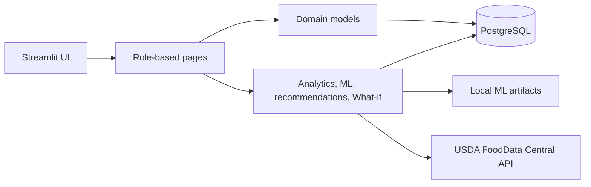

# MacroSense

[](https://github.com/stefan1condeescu/MacroSense/actions/workflows/tests.yml)

MacroSense is a Python and Streamlit application for nutrition, activity, and body-weight tracking. It turns daily journal data into dashboard analytics, explainable recommendations, What-if scenarios, and 14/30-day weight predictions.

Built as my bachelor's degree project in Economic Informatics, the application combines a structured Python codebase, PostgreSQL data integrity, direct database access, analytics, machine learning, and automated tests in one local system.

The user interface is in Romanian, while the source code, database objects, and technical documentation use English names.

## Highlights

- Food, activity, weight, and custom-meal journals with edit and delete flows.
- User and administrator roles with separate navigation and catalog permissions.
- BMI, BMR, estimated TDEE, calorie balance, consistency, and macronutrient analytics.
- Leakage-aware feature engineering and 14/30-day weight prediction.
- A read-only What-if simulator that never writes simulated values to PostgreSQL.
- Optional USDA FoodData Central import with source metadata and duplicate checks.
- Validation across the Streamlit UI, Python models, and PostgreSQL constraints.
- Synthetic demo data and a broad `unittest` regression suite.

## Architecture



The project keeps Streamlit pages focused on interaction and delegates reusable behavior to model and service modules. PostgreSQL is accessed directly through `psycopg2`; no ORM is used.

## Core Workflows

### Food and custom meals

Users can log catalog foods or reusable custom meals, preview calories and macronutrients, and edit or delete entries. Custom meals store nutrition snapshots when logged, so later recipe edits do not rewrite historical journal data.

### Activities and weight

Activity calories can be estimated through MET-based logic, a TUT-inspired strength-training calculation, or an optional value reported by a wearable or cardio machine. Weight history is used as a reference for calculations, and only affected journal days are recalculated when a weight entry changes.

### Dashboard and recommendations

The read-only dashboard derives BMI, BMR, estimated TDEE, calorie balance, consistency indicators, protein per kilogram, charts, recommendation cards, and weight predictions. Missing food logs remain missing data rather than being treated as zero-calorie days.

### Machine learning

The local ML pipeline includes:

- reproducible synthetic history generation;
- features built only from information available up to the analysis date;
- separate 14-day and 30-day prediction horizons;
- Ridge, Random Forest, Gradient Boosting, and conservative hybrid candidates;
- comparison with no-change, trend, and energy-balance baselines;
- saved artifacts and metadata used by the dashboard.

### What-if simulation

Users can modify food quantities and activities in a temporary scenario, compare it with the real selected day, and inspect a theoretical repeated 14/30-day impact. Scenario changes stay in session state and are not persisted.

## Tech Stack

- Python 3.12
- Streamlit
- PostgreSQL and psycopg2
- pandas and Altair
- scikit-learn
- unittest
- USDA FoodData Central API

## Project Structure

```text
app.py                      Streamlit entrypoint and role-based routing
database.py                 Environment/secrets-based PostgreSQL connection
schema.sql                  PostgreSQL schema, constraints, and triggers
assets/style.css            Shared UI styling
ui/                         Pages, routes, validation, tables, and formatting
models/                     Authentication and domain models
models/tracking_models/     Food, activity, journal, meal, and weight classes
services/analytics/         Dashboard aggregation and energy calculations
services/ml/                Synthetic data, features, training, and prediction
services/what_if/           Read-only scenario simulation
services/recommendations/   Explainable recommendation rules
database/seeds/             Catalog and synthetic demo data
tests/                      Automated unittest suite
```

## Local Setup

### 1. Create the environment

```bash
python3.12 -m venv .venv
.venv/bin/python -m pip install -r requirements.txt
```

### 2. Configure PostgreSQL

Create a local PostgreSQL database named `macrosense_db`, then copy the example configuration:

```bash
cp .streamlit/secrets.toml.example .streamlit/secrets.toml
```

Set your own local database password in `.streamlit/secrets.toml`. The real secrets file is ignored by Git.

The same values can be supplied as environment variables instead:

```text
DB_HOST
DB_PORT
DB_NAME
DB_USER
DB_PASSWORD
FDC_API_KEY (optional)
```

### 3. Initialize the database

Run the SQL files in this order using pgAdmin Query Tool or `psql`:

```text
schema.sql
database/seeds/seed_food_items_usda_starter.sql
database/seeds/seed_activities_compendium_official.sql
database/seeds/seed_activities_macrosense_mappings.sql
database/seeds/seed_demo_users.sql
```

The seed data contains catalog entries, official Compendium activities, MacroSense activity mappings, and five synthetic user histories suitable for demonstrating the dashboard and ML flows.

### 4. Generate ML artifacts

Model files are intentionally excluded from Git. Generate them locally with:

```bash
.venv/bin/python -m services.ml.train_models --user-count 50 --history-days 150
```

### 5. Run the application

```bash
.venv/bin/python -m streamlit run app.py --server.address 127.0.0.1 --server.port 8501
```

Open `http://127.0.0.1:8501`.

## Demo Accounts

The optional demo seed creates deliberately public local credentials for presentation and testing:

```text
Administrator: admin@test.com / parola123

Users:
demo.slabire@test.com
demo.masa@test.com
demo.mentinere@test.com
demo.activ@test.com
demo.rar@test.com

User password: test123
```

These accounts are synthetic and are not intended for a public deployment.

## Tests

```bash
.venv/bin/python -m unittest discover -s tests -v
```

The suite covers model validation, authentication helpers, catalog seeds, dashboard analytics, ML feature engineering/training/prediction, What-if behavior, USDA parsing, routing, UI helpers, and schema consistency.

Current local result: **307 tests passed** on Python 3.12.

## Engineering Decisions

- Journal input is validated in the UI, model layer, and database.
- Dashboard and What-if reads do not create empty daily logs.
- User-entered values rendered through custom HTML are escaped.
- SQL statements use parameterized values for runtime data.
- External food records retain source and external-id metadata.
- Future-dated journal writes are blocked in Python and PostgreSQL.
- ML features use past-only references to reduce data leakage.
- Runtime credentials and API keys are loaded from untracked secrets or environment variables.

## Scope

MacroSense is a functional academic prototype intended for local demonstration and portfolio review. Authentication and the public demo credentials are designed for a local project environment, not as a production security model.

Data sources include USDA FoodData Central and the 2024 Adult Compendium of Physical Activities. MacroSense-specific activity mappings are labeled separately from official Compendium entries.
